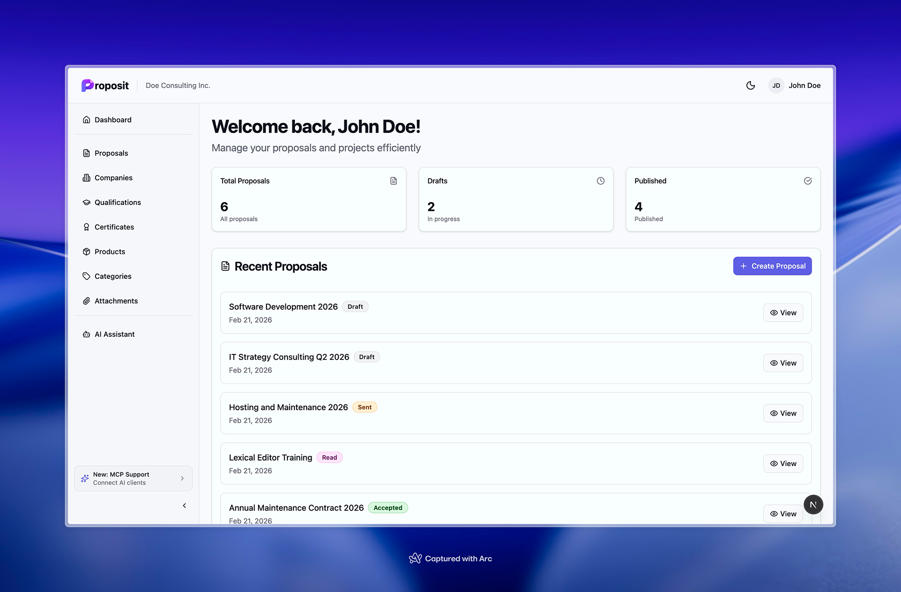

# Proposit

A self-hosted proposal management tool built with Next.js, Supabase, and Lexical. Create and manage business proposals in single-tenant or multi-tenant mode.



## Features

- Single-tenant and multi-tenant modes via `NEXT_PUBLIC_TENANT_MODE`
- Organisations with role-based access (admin / member)
- Rich text editor powered by Lexical
- PDF export via headless Chromium
- AI assistant with configurable system prompts and organisation-level API keys
- Real-time updates via Supabase Realtime
- Drag-and-drop item reordering
- Public proposal sharing with optional token-based access
- Email sending for proposals and invitations (SMTP)
- MCP server endpoint for external AI tool access
- Internationalisation: English and German

## Tech Stack

- **Framework**: Next.js 15 (App Router)
- **Language**: TypeScript (strict)
- **Database / Auth / Realtime**: Supabase
- **Editor**: Lexical
- **UI**: Tailwind CSS + ShadCN UI (Radix primitives)
- **State / Fetching**: Zustand + SWR
- **AI**: Vercel AI SDK + Anthropic
- **Drag & Drop**: dnd-kit
- **i18n**: next-intl

## Prerequisites

- Node.js 18.17 or later
- [pnpm](https://pnpm.io) (`npm install -g pnpm`)
- A [Supabase](https://supabase.com) project (cloud or self-hosted)
- Docker — only required for local Supabase development (not needed for cloud Supabase)

## Getting Started

### 1. Clone the repository

```bash
git clone <repository-url>
cd proposit
```

### 2. Install dependencies

```bash
pnpm install
```

### 3. Configure environment variables

```bash
cp .env.example .env.local
```

Fill in the values in `.env.local`:

| Variable                        | Description                                                     |
| ------------------------------- | --------------------------------------------------------------- |
| `NEXT_PUBLIC_SUPABASE_URL`      | Your Supabase project URL                                       |
| `NEXT_PUBLIC_SUPABASE_ANON_KEY` | Supabase publishable/anon key                                   |
| `SUPABASE_SERVICE_ROLE_KEY`     | Supabase service role key (server-side only)                    |
| `NEXT_PUBLIC_APP_URL`           | Public URL of your app (e.g. `http://localhost:3000`)           |
| `ENCRYPTION_KEY`                | 32-byte hex key — generate with `openssl rand -hex 32`          |
| `SMTP_HOST`                     | SMTP server host (optional — disables email if omitted)         |
| `SMTP_PORT`                     | SMTP port                                                       |
| `SMTP_SECURE`                   | `true` for TLS, `false` for STARTTLS                            |
| `SMTP_USER`                     | SMTP username                                                   |
| `SMTP_PASS`                     | SMTP password or API key                                        |
| `SMTP_FROM`                     | Sender address, e.g. `"My App <hello@example.com>"`             |
| `NEXT_PUBLIC_TENANT_MODE`       | `single` (default) or `multi` — see [Tenant Mode](#tenant-mode) |

### 4. Set up the database

Apply all migrations to your Supabase project:

```bash
pnpm db:push
```

Or for local development with Docker:

```bash
pnpm db:start   # start local Supabase
pnpm db:reset   # apply all migrations to local DB
```

See `context/supabase-local-dev.md` for the full local development workflow.

### 5. Run the development server

```bash
pnpm dev
```

Open [http://localhost:3000](http://localhost:3000) and sign up for an account.

## Available Scripts

```bash
pnpm dev             # Start dev server (localhost:3000)
pnpm build           # Production build
pnpm lint            # ESLint check
pnpm lint:fix        # ESLint auto-fix
pnpm type-check      # TypeScript type checking
pnpm format          # Format with Prettier

pnpm db:start        # Start local Supabase (Docker required)
pnpm db:stop         # Stop local Supabase
pnpm db:push         # Push migrations to cloud database
pnpm db:reset        # Re-apply all migrations on local DB
pnpm db:migrate      # Create new migration file
```

## Project Structure

```
app/[locale]/
  (auth)/          # Login, signup, password reset
  (dashboard)/     # Protected routes (requires auth + organisation)
  (public)/        # Public proposal view (/proposals/[id])
app/api/           # API routes (AI chat, PDF, organisations, MCP)
components/        # React components
  ui/              # ShadCN UI base components
  crud/            # Reusable DataTable and CrudForm
lib/               # Services, stores, utilities, types
messages/          # i18n translation files (en.json, de.json)
supabase/
  migrations/      # All schema changes as SQL files
  seed.sql         # Sample data for local development
context/           # Developer reference docs
```

## Database Migrations

All schema changes are managed via Supabase CLI migrations in `supabase/migrations/`. Never edit the schema directly in the Supabase Studio.

```bash
# Create a new migration
pnpm db:migrate add_something

# Apply locally
pnpm db:reset

# Apply to production (before deploying code)
pnpm db:push
```

## Tenant Mode

Controlled by the `NEXT_PUBLIC_TENANT_MODE` environment variable.

| Mode               | Behaviour                                                                                                                                                                                 |
| ------------------ | ----------------------------------------------------------------------------------------------------------------------------------------------------------------------------------------- |
| `single` (default) | One organisation. The first user registers normally and creates the organisation via the setup wizard. After that, the signup page is closed — further users must be invited by an admin. |
| `multi`            | Open registration. Each user creates their own organisation.                                                                                                                              |

## Deployment

The app is a standard Next.js application and can be deployed to any platform that supports Node.js (Vercel, Railway, Fly.io, etc.).

## Internationalisation

Supported locales: `en`, `de`. Translation files are in `messages/`. To add a new language:

1. Copy `messages/en.json` to `messages/<locale>.json` and translate
2. Add the locale to the `locales` array in `i18n.ts` and `middleware.ts`

## Contributing

Pull requests are welcome. For larger changes, please open an issue first to discuss the approach.

1. Fork the repository
2. Create a feature branch: `git checkout -b feat/your-feature`
3. Commit your changes: `git commit -m 'feat: add your feature'`
4. Push and open a pull request

## License

MIT — see [LICENSE](LICENSE) for details.
